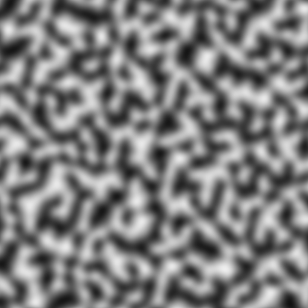
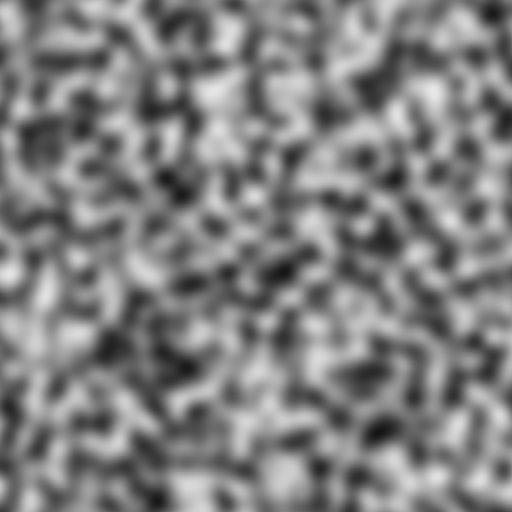
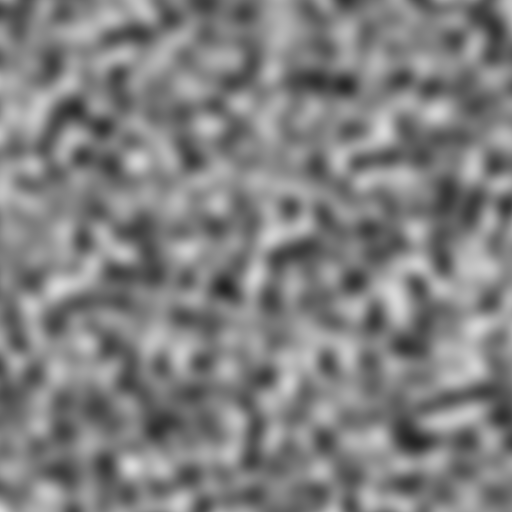

OpenSimplex Noise
================================================================================

        OpenSimplex noise is an n-dimensional gradient noise function that was
        developed in order to overcome the patent-related issues surrounding
        Simplex noise, while continuing to also avoid the visually-significant
        directional artifacts characteristic of Perlin noise.

This is merely a python port of Kurt Spencer's original code (released
to the public domain) and neatly wrapped up in a package.

STATUS
================================================================================

Library is stable, it has pretty good test coverage but haven't gotten
much optimizations.

**Tested with Python 2.7, 3.5, 3.6, 3.7, 3.8 on Linux, MacOS and
Windows**

I like to think that the lack of recent commits is a sign of stable and
feature complete code ;)

USAGE
================================================================================

**Initialization:**

        >>> from opensimplex import OpenSimplex
        >>> tmp = OpenSimplex()
        >>> print (tmp.noise2d(x=10, y=10))
        0.732051569572

Optionally, the class accepts a seed value:

        >>> tmp = OpenSimplex(seed=1)
        >>> print (tmp.noise2d(x=10, y=10))
        -0.4790979022623557

The seed must be a valid python number. It's used internally to
generate some permutation arrays, which is used for the noise
generation.

If it isn't provided the class will **default to use 0 as the seed**.

**Available class methods:**

*OpenSimplex.noise2d(x, y)*

> Generate 2D OpenSimplex noise from X,Y coordinates.

*OpenSimplex.noise3d(x, y, z)*

> Generate 3D OpenSimplex noise from X,Y,Z coordinates.

*OpenSimplex.noise4d(x, y, z, w)*

> Generate 4D OpenSimplex noise from X,Y,Z,W coordinates.

**Running tests and benchmarks:**

First make a virtualenv and install the dev. requirements:

        virtualenv venv
        source venv/bin/activate
        pip install -r requirements.txt

and then simply run the tests:

        make test

or the basic benchmark:

        make benchmark

FAQ
================================================================================

- Is this relevantly different enough to avoid any real trouble with the
original patent?

    > If you read the [patent
    > claims](http://www.google.com/patents/US6867776):
    >
    > Claim #1 talks about the hardware-implementation-optimized
    > gradient generator. Most software implementations of Simplex Noise
    > don't use this anyway, and OpenSimplex Noise certainly doesn't.
    >
    > Claim #2(&3&4) talk about using (x',y',z')=(x+s,y+s,z+s) where
    > s=(x+y+z)/3 to transform the input (render space) coordinate onto
    > a simplical grid, with the intention to make all of the
    > "scissor-simplices" approximately regular. OpenSimplex Noise (in
    > 3D) uses s=-(x+y+z)/6 to transform the input point to a point on
    > the Simplectic honeycomb lattice so that the simplices bounding
    > the (hyper)cubes at (0,0,..,0) and (1,1,...,1) work out to be
    > regular. It then mathematically works out that s=(x+y+z)/3 is
    > needed for the inverse transform, but that's performing a
    > different (and opposite) function.
    >
    > Claim #5(&6) are specific to the scissor-simplex lattice. Simplex
    > Noise divides the (squashed) n-dimensional (hyper)cube into n!
    > simplices based on ordered edge traversals, whereas OpenSimplex
    > Noise divides the (stretched) n-dimensional (hyper)cube into n
    > polytopes (simplices, rectified simplices, birectified simplices,
    > etc.) based on the separation (hyper)planes at integer values of
    > (x'+y'+z'+...).
    >
    > Another interesting point is that, if you read all of the claims,
    > none of them appear to apply to the 2D analogue of Simplex noise
    > so long as it uses a gradient generator separate from the one
    > described in claim #1. The skew function in Claim #2 only
    > applies to 3D, and #5 explicitly refers to n>=3.
    >
    > And none of the patent claims speak about using surflets /
    > "spherically symmetric kernels" to generate the "images with
    > texture that do not have visible grid artifacts," which is
    > probably the biggest similarity between the two algorithms.
    >
    > - **Kurt**, on [Reddit](https://www.reddit.com/r/proceduralgeneration/comments/2gu3e7/like_perlins_simplex_noise_but_dont_like_the/ckmqz2y)

CREDITS
================================================================================

- Kurt Spencer - Original work
- A Svensson - Python port and package author
- CreamyCookie - Cleanup and optimizations
- Owen Raccuglia - Test cases
- /u/redblobgames - Fixed conversion for Java's long type, see [Reddit](https://old.reddit.com/r/proceduralgeneration/comments/327zkm/repeated_patterns_in_opensimplex_python_port/cq8tth7/)
- PetyaVasya - Found bug with using c_long on Windows systems, see [Issue #7](https://github.com/lmas/opensimplex/issues/7)

LICENSE
================================================================================

While the original work was released to the public domain by Kurt, this
package is using the MIT license. Please see the file LICENSE for
details.

Expected Output
================================================================================

2D noise (with default seed):

{width="100px" height="100px"}

3D noise:

{width="100px" height="100px"}

4D noise:

{width="100px" height="100px"}
